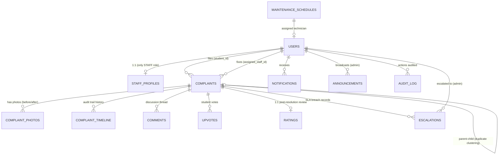
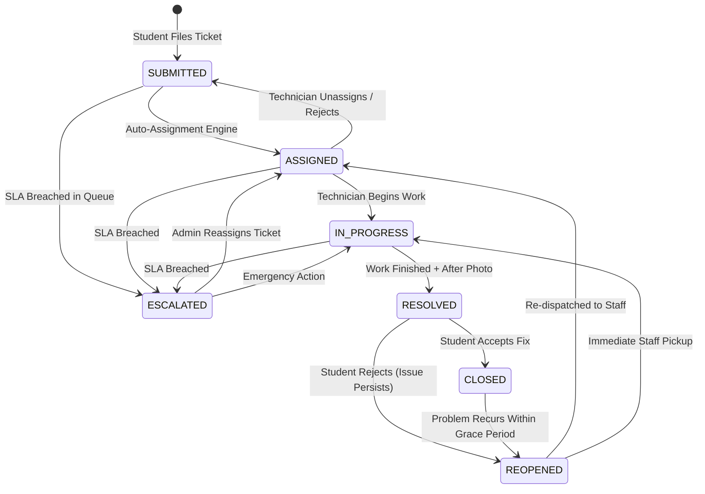

# FixMate — Master System Architecture (Deep Technical Specification)

> **Document Type:** Production Architecture, System Design & Interview Defense Manual  
> **Target Project:** FixMate — Smart Hostel Complaint & Maintenance Management System  
> **Source Code Verification:** 100% Grounded in Project Repository  

---

## 1. What Is FixMate? (Interview Opening — Pitch & Elevator Summary)

> *"FixMate is an enterprise-grade, event-driven hostel complaint and facility management platform designed for campus environments with 500+ residents. In typical hostels, maintenance issues (water leakage, power outages, broken appliances, WiFi dropouts) are managed through disorganized WhatsApp groups or physical registers. Tickets get lost, SLAs are breached without accountability, and admins have zero visibility.
>
> FixMate solves this end-to-end: students submit geo-tagged complaints with photographic proof; an **Intelligent Auto-Assignment Engine** evaluates the ticket using a **Weighted Burden Scoring algorithm** to dispatch it to the optimal on-duty technician (specialist with fallback to general staff); a **Safety Keyword Engine** auto-escalates hazardous issues to CRITICAL; an **SLA Escalation Engine** monitors deadlines with 1-hour proactive warnings; and a **Dual-Channel Notification System (WebSocket + Redis Pub/Sub + Email)** keeps everyone synchronized in real time.
>
> I architected the backend using **Spring Boot 3.3.5 and Java 21** with **PostgreSQL 16**, built the frontend with **React 18, TypeScript, and TanStack Query**, powered distributed caching and message broadcasting with **Redis 7**, secured photo assets via **MinIO S3-compatible private storage with HMAC-SHA256 presigned URLs**, and unified routing through an **Nginx reverse proxy** inside isolated Docker containers."*

---

## 2. End-to-End Request & Data Flow (The 19-Step Architecture Walkthrough)

When a student accesses the platform, logs in, and establishes a live session, the system executes this precise lifecycle:

```
[Browser Client]
       │
       ▼ (Port 80)
┌────────────────────────────────────────────────────────┐
│                   Nginx Reverse Proxy                  │
│  - Port 80 Single Entry Point (Zero CORS)              │
│  - /api/*    ──► Spring Boot Backend (:8080)           │
│  - /ws       ──► WebSocket HTTP/1.1 Upgrade (:8080)    │
│  - /*        ──► React Frontend Static Container (:80) │
└──────┬──────────────────────┬──────────────────┬───────┘
       │                      │                  │
       │ (1. Initial Load)    │ (2. REST APIs)   │ (3. WS Upgrade)
       ▼                      ▼                  ▼
┌──────────────┐      ┌──────────────┐   ┌────────────────────────┐
│ React + Vite │      │ Spring Boot  │   │  STOMP WebSocket Hub   │
│ SPA Bundle   │      │ 3.3.5 (Java) │   │  JwtAuthChannelInterc. │
└──────────────┘      └──────┬───────┘   └───────────┬────────────┘
                             │                       │
              ┌──────────────┴──────────────┐        │
              ▼                             ▼        ▼
       ┌──────────────┐              ┌────────────────────────┐
       │ PostgreSQL 16│              │        Redis 7         │
       │ 13 Relational│              │ - Refresh Token Store  │
       │ Entities     │              │ - Pub/Sub Event Relay  │
       └──────────────┘              └────────────────────────┘
```

### Detailed Step-by-Step Execution:

1. **Step 1:** Student opens browser and navigates to `http://localhost`.
2. **Step 2:** The browser initiates an HTTP connection on port **80**, received by the **Nginx Reverse Proxy**.
3. **Step 3 (Nginx Path Resolution):**
   * If URL prefix is `/api/` $\rightarrow$ Nginx proxies to `http://backend:8080`.
   * If URL prefix is `/ws` $\rightarrow$ Nginx performs HTTP/1.1 protocol upgrade (`Upgrade: websocket`, `Connection: "upgrade"`) with `proxy_read_timeout 86400s`.
   * If URL prefix is `/actuator/` $\rightarrow$ Proxies health probes to backend.
   * Any other path $\rightarrow$ Nginx proxies to `http://frontend:80` (React SPA).
4. **Step 4:** On first load, Nginx delivers the compiled React bundle (`index.html`, chunked `.js`, `.css`) served with Gzip level 6 compression and immutable caching.
5. **Step 5:** React SPA mounts client-side routing via React Router DOM, rendering the Login View.
6. **Step 6:** Student inputs credentials and submits: React dispatches `POST /api/v1/auth/login`.
7. **Step 7:** Nginx proxies the request to Spring Boot while appending proxy headers (`X-Real-IP`, `X-Forwarded-For`, `X-Forwarded-Proto`).
8. **Step 8 (Security Filter Chain Bypass):** Spring Security's `JwtAuthFilter` checks the URL against permit-all endpoints (`/api/v1/auth/**`, `/ws/**`, `/actuator/health`) and bypasses Bearer token validation.
9. **Step 9:** Request reaches `AuthController.login()` $\rightarrow$ delegates to `AuthService.login()` $\rightarrow$ passes `UsernamePasswordAuthenticationToken` to Spring's `AuthenticationManager`.
10. **Step 10:** `AuthenticationManager` invokes `CustomUserDetailsService.loadUserByUsername(email)`.
11. **Step 11:** `CustomUserDetailsService` queries PostgreSQL: `SELECT * FROM users WHERE email = ? AND is_active = true`.
12. **Step 12:** `DaoAuthenticationProvider` matches the raw password with the stored BCrypt hash (`$2a$10$...`) using salted, slow-hashing comparison to resist timing attacks.
13. **Step 13 (Token Generation):** Upon verification, `JwtTokenProvider` generates two separate signed tokens using JJWT (`HMAC-SHA256`):
    * **Access Token:** Short lifespan (**15 minutes**), contains user identity, email, and role authority claim (`ROLE_STUDENT`, `ROLE_STAFF`, or `ROLE_ADMIN`).
    * **Refresh Token:** Long lifespan (**7 days**), minimal claims, used solely for token rotation.
14. **Step 14 (Stateful Token Whitelisting in Redis):** `AuthService` stores the refresh token in Redis: `SET refresh_token:{userId} = token TTL 7 DAYS`. This turns a stateless token into a revocable credential for instant logout and token rotation detection.
15. **Step 15:** Server responds with HTTP 200: `{ accessToken, refreshToken, user: { id, name, email, role, roomNumber, block } }`.
16. **Step 16:** React stores tokens and user identity in **Zustand memory state** (`useAuthStore`). Axios request interceptors are registered to automatically attach `Authorization: Bearer <accessToken>` to all outgoing API calls.
17. **Step 17 (Real-Time WebSocket Handshake):** React initiates a STOMP over SockJS connection to `/ws`, attaching the JWT token inside the STOMP `CONNECT` transport headers.
18. **Step 18:** `WebSocketAuthInterceptor` intercepts the inbound STOMP `CONNECT` frame, extracts the Bearer token, validates signature and expiration, extracts user claims, and sets an authenticated `Principal` into the WebSocket session context.
19. **Step 19:** Connection established! The student subscribes to `/topic/complaints` (global updates) and `/user/queue/notifications` (personal real-time alerts).

---

## 3. Technology Stack & Architectural Decision Justifications

```
┌─────────────────────────────────────────────────────────────────────────────┐
│                              TECHNOLOGY STACK                               │
├───────────────────┬───────────────────────────────────┬─────────────────────┤
│ Layer             │ Technology                        │ Key Purpose         │
├───────────────────┼───────────────────────────────────┼─────────────────────┤
│ Reverse Proxy     │ Nginx Alpine                      │ Port 80 Unification │
│ Backend Engine    │ Spring Boot 3.3.5 + Java 21 LTS   │ Core Business Logic │
│ Security          │ Spring Security 6 + JJWT 0.12.6   │ RBAC & Stateless    │
│ Primary Database  │ PostgreSQL 16 (Alpine)            │ Relational + JSONB  │
│ Database Schema   │ Flywaydb Core 10.x                │ Versioned Migration │
│ Distributed Cache │ Redis 7 (Alpine)                  │ TTL Store & Pub/Sub │
│ Object Storage    │ MinIO S3-Compatible Storage       │ Private Photo Vault │
│ Frontend UI       │ React 18.3 + TypeScript 5.5 + Vite│ Single Page App     │
│ Server State      │ TanStack React Query v5           │ Cache & Optimistic  │
│ Client State      │ Zustand 4.5                       │ Auth & Preferences  │
│ Styling & Icons   │ Tailwind CSS 3.4 + Radix UI       │ Modern Design System│
│ Reporting         │ OpenCSV 5.9                       │ Administrative Dumps│
└───────────────────┴───────────────────────────────────┴─────────────────────┘
```

### 3.1 Backend: Spring Boot 3.3.5 & Java 21 LTS
* **Why Spring Boot:** Mature, opinionated ecosystem with native dependency injection, unified transaction management (`@Transactional`), robust connection pooling (HikariCP), and enterprise-grade testing frameworks.
* **Why Java 21:** Leverages modern LTS language features:
  * Pattern matching for `switch` expressions simplifies state machines and priority dispatch.
  * Virtual Threads ready for high-throughput I/O.
  * Records for immutable DTO definitions.
* **Alternatives Evaluated:**
  * *Node.js / Express:* Rejected due to lack of strict compile-time type safety across complex domain models, lack of built-in transaction propagation, and potential event-loop starvation during intensive scoring calculations.
  * *Go (Gin/Fiber):* Superb runtime throughput, but lacks standard enterprise abstractions (Spring Security, Spring Data JPA, automated Flyway migration pipelines).

### 3.2 Database: PostgreSQL 16
* **JSONB Columns for Auditability:** The `audit_log` table stores `old_value` and `new_value` in native binary JSON (`JSONB`). This allows polymorphic logging: a status change records `{"status":"RESOLVED"}`, while an escalation records `{"slaDeadline":"...", "escalatedTo":"..."}`, eliminating the need for sparse tables.
* **Native UUIDv4 Primary Keys:** Prevents ID enumeration attacks (insecure direct object references) and simplifies distributed ID generation without sequence locking.
* **MVCC Concurrency:** PostgreSQL's Multi-Version Concurrency Control prevents read-write contention when background SLA schedulers run concurrent sweeps while students file complaints.

### 3.3 Database Migrations: Flyway
* **Why not `hibernate.ddl-auto=update`?** `ddl-auto=update` can never safely rename columns, drop deprecated structures, or optimize composite indexes. In production, it can freeze or corrupt schemas.
* **Actual Migration Sequence in Codebase:**
  1. `V1__init_schema.sql` $\rightarrow$ Creates all 13 core relational tables, indexes, foreign keys, and constraints.
  2. `V2__seed_data.sql` $\rightarrow$ Provisions initial system admin, categorized technicians, and demo hostel inventory.
  3. `V3__priority_and_assignment_enhancements.sql` $\rightarrow$ Introduces priority reasoning audit columns and assignment indexes.

### 3.4 In-Memory Cache & Message Broker: Redis 7
* **Role 1: Revocable Refresh Token Store:**
  * Key: `refresh_token:{userId}` with TTL of 7 days.
  * $O(1)$ memory lookup avoids database disk I/O on token refresh hot paths.
  * Enables instant user logout (`redisTemplate.delete(...)`) and token rotation replay detection.
* **Role 2: Multi-Instance WebSocket Cluster Relay (Pub/Sub):**
  * In a scaled production cluster, User A connects via WebSocket to Container 1, while Container 2 updates Complaint #101.
  * Container 2 publishes the event payload to Redis channel `fixmate:ws:events`.
  * Container 1's `RedisWebSocketSubscriber` receives the message and pushes it down the local WebSocket pipe to User A.

### 3.5 Object Storage: MinIO (Dual-Client Architecture)
* **Private Bucket Security:** Complaint photos are never public. Direct access to MinIO is firewalled; only authenticated users can view photos via time-limited **Presigned URLs** (1-hour validity).
* **Dual-Client Design Pattern:**
  * `minioClient` (Internal Docker network): Configured to `http://minio:9000` $\rightarrow$ handles server-side streaming uploads from Spring Boot.
  * `presigningMinioClient` (Public endpoint): Configured to `http://localhost:9000` $\rightarrow$ generates HMAC-SHA256 signatures with public-resolvable URLs for client browser rendering.
* **Database Protection:** Storing images in PostgreSQL as BLOBs bloats the database, degrades page cache performance, and causes massive backup sizes. Object storage offloads large binary I/O completely.

### 3.6 Reverse Proxy: Nginx
* **Single Port 80 Unification:** Eliminates cross-origin requests. Frontend, REST APIs, and WebSockets all share the same domain and port (`http://localhost`), bypassing browser CORS preflight checks entirely.
* **WebSocket Keep-Alive:** Nginx is configured with `proxy_read_timeout 86400s` (24 hours) to prevent socket drops during idle periods.
* **High-Efficiency Static Serving:** Uses Linux kernel `sendfile` zero-copy I/O with Gzip compression (`gzip_comp_level 6`), freeing Spring Boot threads from serving static JS/CSS assets.

### 3.7 Frontend Architecture: React 18, TypeScript & TanStack Query
* **TypeScript:** Strict type validation ensuring frontend DTOs mirror backend contracts.
* **TanStack React Query v5:** Handles server-state caching, automatic background refetching on window focus, and cache invalidation upon WebSocket push notifications.
* **Zustand:** Lightweight, boilerplate-free state management for auth credentials, minimizing unnecessary component re-renders compared to Redux.
* **Tailwind CSS + Radix UI:** Accessible, keyboard-navigable UI primitives (dialogs, dropdowns, tabs) styled with responsive utility classes.
* **Recharts:** Composable SVG charting library rendering real-time complaint velocity, category distributions, and staff SLA performance.

---

## 4. Database Architecture — All 13 Entities Deep Dive



### 4.1 The 13 Relational Tables Explained

| # | Entity | Key Attributes | Why It Exists & Structural Rationale |
|---|---|---|---|
| **1** | `User` | `id (UUID)`, `email`, `password_hash`, `role (STUDENT, STAFF, ADMIN)`, `room_number`, `block`, `is_active` | Central authentication identity. Contains student hostel location metadata for automated duplicate detection. |
| **2** | `StaffProfile` | `user_id (FK/PK)`, `category`, `is_on_duty`, `shift_start`, `shift_end`, `avg_rating`, `last_assigned_at` | Isolated 1-to-1 table for staff. Prevents bloating the main `users` table with nullable fields for 500+ student records. |
| **3** | `Complaint` | `id`, `title`, `description`, `category`, `status`, `priority`, `requested_priority`, `priority_source`, `priority_reason`, `sla_deadline`, `reopened_count`, `upvote_count` | Core domain entity. Includes full priority auditing fields and denormalized `upvote_count` for $O(1)$ sorting performance. |
| **4** | `ComplaintPhoto` | `complaint_id`, `photo_url`, `photo_type (BEFORE, AFTER)`, `uploaded_at` | Tracks photographic proof before and after repair. Stored as relative object keys pointing to MinIO. |
| **5** | `ComplaintTimeline`| `complaint_id`, `old_status`, `new_status`, `actor_id`, `action`, `notes`, `created_at` | Append-only immutable ledger recording every event and state transition, creating a full Git-like audit trail. |
| **6** | `Comment` | `complaint_id`, `user_id`, `message`, `is_internal`, `created_at` | Interactive communication thread. `is_internal = true` hides technical or disciplinary notes from students. |
| **7** | `Upvote` | `complaint_id`, `student_id`, `created_at` | Crowdsourcing indicator. Database-level unique constraint on `(complaint_id, student_id)` strictly prevents double-voting. |
| **8** | `Rating` | `complaint_id`, `student_id`, `staff_id`, `rating (1-5)`, `feedback`, `created_at` | Performance tracking. Unique constraint on `complaint_id` permits exactly one rating per resolved ticket. |
| **9** | `Notification` | `user_id`, `type`, `title`, `message`, `reference_id`, `is_read`, `created_at` | Persistent notification store. Ensures offline users review all historical alerts upon logging in. |
| **10**| `Escalation` | `complaint_id`, `escalated_to_admin_id`, `reason`, `breached_at`, `acknowledged` | Created automatically when an active ticket exceeds its SLA deadline. Tracks administrator accountability. |
| **11**| `Announcement` | `created_by_admin_id`, `title`, `message`, `target_audience (ALL, STUDENTS, STAFF)`, `expires_at` | Broadcast system for hostel management (e.g. water tank cleaning, scheduled power outage). |
| **12**| `MaintenanceSchedule`| `title`, `category`, `recurrence_days`, `next_due`, `assigned_staff_id` | Preventive maintenance engine. A daily cron job scans for due dates and auto-generates recurring complaints. |
| **13**| `AuditLog` | `user_id`, `action`, `entity_name`, `entity_id`, `old_value (JSONB)`, `new_value (JSONB)`, `ip_address` | Compliance and security log capturing administrative overrides, privilege changes, and deletions. |

---

## 5. Core Business Engines & Proprietary Algorithms

### 5.1 Intelligent Auto-Assignment Engine (Weighted Burden Scoring)
When a complaint is filed, `AssignmentService` evaluates candidate technicians using a multi-factor load-balancing algorithm rather than naive round-robin:

```
                          Complaint Created
                                  │
                                  ▼
                     [ Find On-Duty Technicians ]
                     Filter by Category: SPECIALIST
                                  │
                 ┌────────────────┴────────────────┐
          (Technicians Found)              (None Available)
                 │                                 │
                 ▼                                 ▼
    [ Calculate Weighted Burden ]           [ Fallback Tier 2: GENERAL ]
    For each candidate:                            │
    Score = (Assigned * 1.0)                       ├── Found ──► [ Calculate Burden ]
          + (In-Progress * 1.5)                    │
          + (Critical * 2.0)                       ▼
                 │                          [ Fallback Tier 3: ANY ON-DUTY ]
                 ▼                                 │
    [ Pick Lowest Burden Score ]                   ├── Found ──► [ Calculate Burden ]
    Tie-Breaker: Oldest last_assigned_at           │
                 │                                 ▼
                 ▼                          [ No Staff On Duty ]
    Assign Staff & Set Status = ASSIGNED    Keep Status = SUBMITTED
                                            Backlog Sweep picks up later
```

#### The Mathematical Scoring Formula:
$$\text{Burden Score} = (N_{\text{ASSIGNED}} \times 1.0) + (N_{\text{IN\_PROGRESS}} \times 1.5) + (N_{\text{CRITICAL}} \times 2.0)$$
* **Rationale:** A technician actively fixing a high-voltage short circuit (`IN_PROGRESS` + `CRITICAL`) carries a burden weight of $3.5$, whereas a technician with an unstarted routine task carries only $1.0$.
* **4-Tier Fallback Chain:**
  1. *Tier 1 (Specialist):* Exact category match (e.g. `ELECTRICIAN` for electrical issues).
  2. *Tier 2 (General Staff):* If all specialists are off-duty, fall back to `GENERAL` category staff.
  3. *Tier 3 (Any Available Staff):* If no general staff, assign to any on-duty technician.
  4. *Tier 4 (Backlog Pool):* If zero technicians are on duty, complaint remains in `SUBMITTED` status.
* **Safety-Net Backlog Sweep:** `AssignmentBacklogScheduler` runs every **10 minutes** (`@Scheduled(fixedRate = 600000)`). The moment a technician clocks in, pending backlog complaints are automatically dispatched.

---

### 5.2 Smart Priority Evaluation Engine (Safety Override)
Students frequently downplay or exaggerate complaints. `PriorityEvaluationService` sanitizes incoming priority using rule-based keyword classification:

```
Student Input (e.g. "Low Priority")
Title: "Short circuit and sparks in switchboard"
                  │
                  ▼
   [ Scan Safety Keyword Lexicon ]
   Keywords: "fire", "spark", "shock", "smoke", "gas", "burst pipe"
                  │
                  ├──► Match Found!
                  │    Elevate Priority ──► CRITICAL
                  │    Set priority_source = KEYWORD_ELEVATED
                  │    Set priority_reason = "Safety hazard detected"
                  │
                  └──► No Critical Match
                       Retain Requested Priority
```

#### SLA Deadlines by Priority Tier:
* **CRITICAL:** **2 Hours** (Immediate safety/infrastructure threat)
* **HIGH:** **8 Hours** (Severe inconvenience e.g. room fan dead in summer)
* **MEDIUM:** **24 Hours** (Standard repair e.g. leaking tap)
* **LOW:** **72 Hours** (Cosmetic repair e.g. loose cupboard handle)

---

### 5.3 Duplicate Detection & Clustering Engine
`DuplicateDetectionService` prevents ticket flooding when a common issue affects multiple students (e.g. entire floor washroom tap broken):
1. Upon complaint submission, the service searches for open complaints matching:
   $$\text{Same Category} \land \text{Same Block} \land \text{Same Room / Common Area} \land \text{Created within 24 Hours}$$
2. If an active match is discovered:
   * The new complaint is marked with `parent_complaint_id = existingComplaint.getId()`.
   * The parent complaint's denormalized `upvote_count` is incremented.
   * A timeline event is logged, informing the student: *"Merged with existing ticket #102"*.
   * Prevents assigning 5 plumbers to the same broken pipe.

---

### 5.4 Dual-Schedule SLA Monitor & Escalation Engine
`SLACheckScheduler` executes two distinct asynchronous cron jobs:
1. **The Escalation Sweep (`fixedRate = 300000` — Every 5 Minutes):**
   * Finds all active tickets (`ASSIGNED`, `IN_PROGRESS`) where `sla_deadline < NOW()`.
   * Transitions status to `ESCALATED`.
   * Creates an `Escalation` audit record linked to the Chief Warden / Admin.
   * Fires high-priority alerts via WebSocket and Email.
2. **The Proactive Early Warning Sweep (`cron = "0 0 * * * *"` — Hourly):**
   * Identifies tickets where deadline expires within **1 hour**:
     $$\text{NOW}() < \text{sla\_deadline} \le \text{NOW}() + 1\text{ hour}$$
   * Dispatches proactive `SLA_WARNING` notifications to the assigned technician: *"⏰ 60 minutes remaining on Ticket #42"*, preventing breaches before they happen.

---

## 6. Complaint Lifecycle & State Machine

FixMate enforces lifecycle integrity through `ComplaintStateMachine.java`. Any unauthorized or illegal transition triggers an immediate `InvalidStateTransitionException`.



---

## 7. Key Interview Defense Scenarios (Q&A)

### Q1: Why do you return both Access Token and Refresh Token to the client if the Refresh Token is already stored in Redis?
> *"The Refresh Token in Redis serves as a **Server-Side Whitelist and Revocation Registry**, not as a substitute for client identification. Because Access Tokens expire rapidly (15 minutes), the client must present its secret Refresh Token to `/api/v1/auth/refresh` to obtain a new Access Token without prompting the student for credentials. The backend retrieves the token stored under `refresh_token:{userId}` in Redis and validates strict equality. If a user logs out, or if an admin revokes their session, the key is removed from Redis, immediately invalidating the client's token even if its cryptographic signature is still valid."*

### Q2: What happens if we remove Nginx entirely and expose Spring Boot directly?
> *"Removing Nginx introduces 5 critical issues:
> 1. **Port fragmentation:** Frontend runs on port 3000, backend on 8080.
> 2. **CORS Overhead:** Different ports constitute different browser origins. Every API request triggers an HTTP OPTIONS preflight check.
> 3. **Relative routing breakdown:** Frontend relative paths (`/api/...`, `/ws`) fail unless hardcoded to absolute URLs.
> 4. **Resource waste:** Spring Boot's Tomcat worker threads are forced to serve static React bundles instead of Nginx's asynchronous, zero-copy `sendfile` I/O.
> 5. **Security vulnerability:** Spring Boot and internal Actuator endpoints become directly exposed to external internet scans and slowloris attacks without a protective buffer."*

### Q3: How do you solve the Hibernate N+1 query problem in FixMate?
> *"We maintain a strict rule: all `@ManyToOne` and `@OneToMany` relationships are set to `FetchType.LAZY`. For read operations that require related records (e.g. listing complaints with their student and assigned technician details), we bypass lazy-loading cascades by utilizing explicit `JOIN FETCH` queries or Spring Data `@EntityGraph(attributePaths = {"student", "assignedStaff", "photos"})`. This loads the entire object graph in a single SQL query."*

### Q4: How does your WebSocket architecture scale across multiple server instances?
> *"WebSocket connections maintain persistent in-memory TCP sockets tied to a specific container. If User A is connected to Instance 1, and an admin updates a ticket on Instance 2, Instance 2 cannot directly message User A. FixMate resolves this through **Redis Pub/Sub Clustering**: Instance 2 serializes the notification and publishes it to the Redis channel `fixmate:ws:events`. All running instances subscribe to this channel; Instance 1 picks up the message, identifies that User A's session is local, and delivers the STOMP frame seamlessly."*

---

## 8. Verification & Project Alignment Checklist

| Feature in Documentation | Source Code Location in FixMate | Status |
|---|---|---|
| Auto-Assignment Burden Score | [AssignmentService.java](file:///d:/FixMate/backend/src/main/java/com/fixmate/service/AssignmentService.java) | ✅ Verified |
| Safety Keyword Priority Override | [PriorityEvaluationService.java](file:///d:/FixMate/backend/src/main/java/com/fixmate/service/PriorityEvaluationService.java) | ✅ Verified |
| Duplicate Detection Clustering | [DuplicateDetectionService.java](file:///d:/FixMate/backend/src/main/java/com/fixmate/service/DuplicateDetectionService.java) | ✅ Verified |
| 10-Min Backlog Sweep Scheduler | [AssignmentBacklogScheduler.java](file:///d:/FixMate/backend/src/main/java/com/fixmate/scheduler/AssignmentBacklogScheduler.java) | ✅ Verified |
| SLA 5-Min Sweep & 1-Hr Warning | [SLACheckScheduler.java](file:///d:/FixMate/backend/src/main/java/com/fixmate/scheduler/SLACheckScheduler.java) | ✅ Verified |
| 13 Core Model Entities | [com.fixmate.model](file:///d:/FixMate/backend/src/main/java/com/fixmate/model) | ✅ Verified |
| State Machine Transitions | [ComplaintStateMachine.java](file:///d:/FixMate/backend/src/main/java/com/fixmate/service/ComplaintStateMachine.java) | ✅ Verified |
| MinIO Dual-Client Presigning | [MinioConfig.java](file:///d:/FixMate/backend/src/main/java/com/fixmate/config/MinioConfig.java) & [FileStorageService.java](file:///d:/FixMate/backend/src/main/java/com/fixmate/service/FileStorageService.java) | ✅ Verified |
| Redis Pub/Sub WS Relay | [RedisWebSocketSubscriber.java](file:///d:/FixMate/backend/src/main/java/com/fixmate/config/RedisWebSocketSubscriber.java) | ✅ Verified |
| Frontend TanStack & Radix UI | [package.json](file:///d:/FixMate/frontend/package.json) | ✅ Verified |
